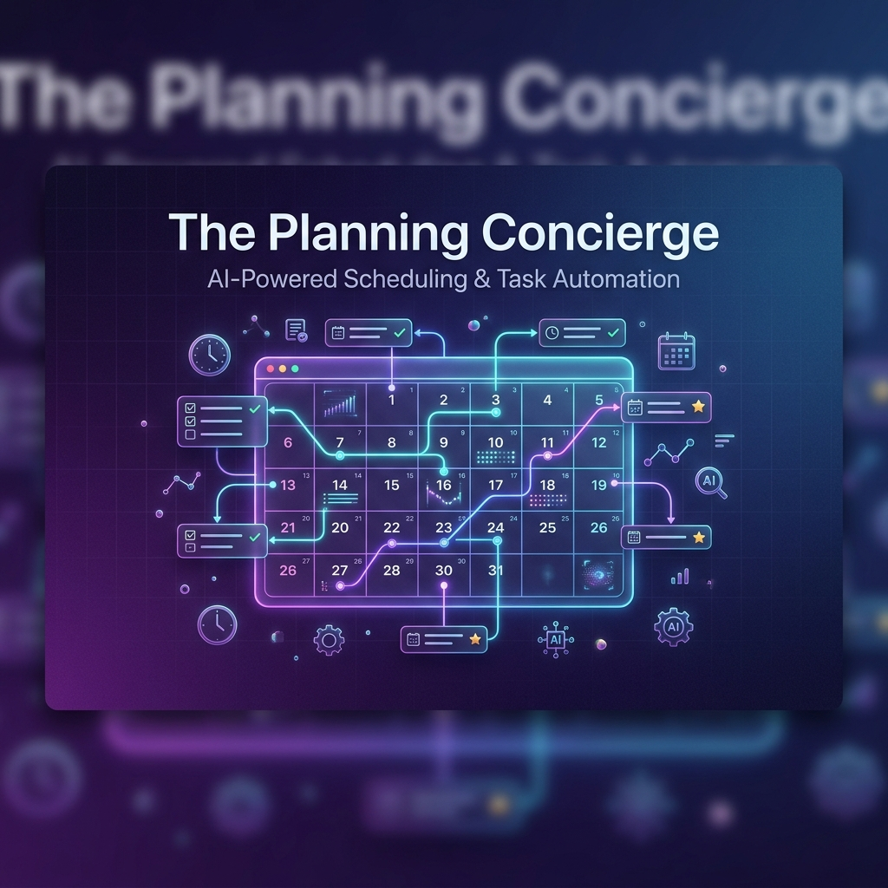
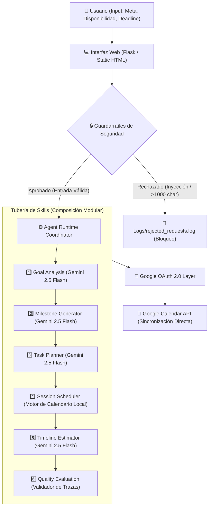

<p align="center">
  
</p>

<h1 align="center">🗓️ The Planning Concierge</h1>

<p align="center">
  <strong>Goal Planning & Execution Agent (Concierge Track)</strong>
</p>

<p align="center">
  
  
  
  
  
  
</p>

<p align="center">
  An intelligent, secure <strong>Concierge Agent</strong> designed to transform natural language goals into complete, structured plans, schedule study/work sessions aligned with user availability, and execute calendar synchronization directly via the Model Context Protocol (MCP) and Google APIs.
</p>

<p align="center">
  <a href="https://goal-breakdown-agent-61703236417.us-central1.run.app/"><strong>🚀 Probar Demo en Vivo</strong></a> • 
  <a href="https://youtu.be/Yjyu_2OFxck"><strong>🎥 Video de Demostración</strong></a> • 
  <a href="docs/presentation_script.MD"><strong>🎬 Guión de Presentación</strong></a> • 
  <a href="docs/"><strong>📂 Diapositivas y Materiales</strong></a> • 
  <a href="tests/"><strong>🧪 Pruebas Unitarias</strong></a> • 
  <a href="evaluation/"><strong>📊 Suite de Evaluación</strong></a>
</p>

---

## 🎯 Resumen Ejecutivo: Problema y Solución

<table width="100%">
  <tr>
    <td width="55%" valign="top">
      <h3>❌ El Vacío de Ejecución</h3>
      <p>
        Lograr metas personales o de certificación (como <i>"Aprender Python"</i> o <i>"Certificación Cisco CyberOps"</i>) suele fallar debido al esfuerzo cognitivo necesario para planificar.
      </p>
      <ul>
        <li><strong>Complejidad</strong>: Descomponer un objetivo grande en hitos cronológicos es difícil.</li>
        <li><strong>Fricción de Horarios</strong>: Asignar tareas a bloques de estudio específicos en el día a día es tedioso.</li>
        <li><strong>Falta de Integración</strong>: Las listas de tareas aisladas rara vez se ejecutan si no están integradas en nuestras herramientas cotidianas (como Google Calendar).</li>
      </ul>
    </td>
    <td width="45%" valign="top">
      <h3>✨ La Solución Concierge</h3>
      <p>
        <strong>The Planning Concierge</strong> cierra esta brecha automatizando todo el ciclo:
      </p>
      <ol>
        <li><strong>Entrada Natural</strong>: Recibe metas, fecha límite y horarios de disponibilidad semanal.</li>
        <li><strong>Descomposición en Cascada</strong>: Descubre y ejecuta habilidades (<i>skills</i>) especializadas para estructurar el plan.</li>
        <li><strong>Sincronización Inteligente</strong>: Agenda automáticamente bloques en tu <strong>Google Calendar</strong> respetando zonas horarias, sin solapamientos.</li>
        <li><strong>Seguridad Multi-Tenant</strong>: Autenticación OAuth 2.0 segura y temporal para producción.</li>
      </ol>
    </td>
  </tr>
</table>

---

## 🏗️ Arquitectura del Agente

El sistema utiliza un orquestador que gestiona la entrada del usuario, la valida contra **guardarraíles de seguridad**, carga de manera dinámica los **skills independientes** (en `skills/`), genera el plan óptimo y escribe en el calendario usando la API directa con credenciales OAuth.



---

## ⚡ Conceptos Clave del Curso Implementados

Este proyecto de Capstone demuestra la aplicación de **5 tecnologías y arquitecturas clave** impartidas en el curso de Vibe Coding:

### A. Tubería de Agente Componible (*Composed Agent*)
En lugar de una llamada masiva monolítica a un LLM, el coordinador escanea la carpeta [skills/](file:///c:/Users/Xaviaerox/Documents/GitHub/goal-breakdown-agent/skills) y ejecuta dinámicamente un pipeline estructurado en 6 pasos para obtener un resultado determinista y evaluable.

### B. Integración Directa con la API de Google
El agente interactúa de forma directa con la **API de Google Calendar** para insertar y agrupar los bloques de estudio, abstrayendo la complejidad de zonas horarias y offsets.

### C. Guardarraíles de Seguridad y Auditoría
Un módulo dedicado de seguridad ([guardrails.py](file:///c:/Users/Xaviaerox/Documents/GitHub/goal-breakdown-agent/security/guardrails.py)) limpia las entradas y evita ataques de inyección de prompts, malware o entradas excesivamente largas antes de consumir tokens de LLM.

### D. Migración de SDK a `google-genai`
El código utiliza exclusivamente el nuevo cliente unificado oficial de Google (`google-genai`) y la sintaxis estructurada recomendada en la especificación más reciente.

### E. Despliegue Multi-Inquilino (*Multi-Tenant OAuth*)
Diseñado como un servicio SaaS real alojado en **Google Cloud Run**. Permite el login seguro y dinámico de cualquier usuario a través del consentimiento oficial de Google, almacenando de forma segura los tokens temporales de acceso en la sesión encriptada de Flask.

---

## 🛠️ Habilidades Modulares (Skills)

Ubicadas en la carpeta `skills/`, cada una tiene su propio archivo markdown de instrucciones:

| Habilidad (Skill) | Directorio | Descripción / Gatillador |
| :--- | :--- | :--- |
| **Goal Analysis** | `skills/goal-analysis` | Extrae y analiza los parámetros clave de la meta y restricciones. |
| **Milestone Generator** | `skills/milestone-generator` | Divide el objetivo general en hitos y fases progresivas de aprendizaje. |
| **Task Planner** | `skills/task-planner` | Diseña tareas de estudio detalladas y accionables para cada hito. |
| **Session Scheduler** | `skills/session-scheduler` | Distribuye cronológicamente las horas de estudio semanales sin solapamientos. |
| **Timeline Estimator** | `skills/timeline-estimator` | Calcula el ritmo de trabajo y estima la fecha final de cumplimiento. |
| **Evaluation Suite** | `skills/evaluation` | Autoevalúa la coherencia del plan generado frente a las directrices de calidad. |

---

## 🧪 Pruebas y Evaluación Automatizada

> [!NOTE]
> Para garantizar la máxima fiabilidad, el agente cuenta con una suite completa de pruebas unitarias y de integración que se ejecutan automáticamente.

* **Pruebas Unitarias (`pytest`)**: Prueban las rutas web, guardarraíles y la lógica del calendario utilizando mocks.
  ```bash
  pytest tests/test_app.py
  ```
* **Marco de Evaluación (`run_evaluation.py`)**: Evalúa el rendimiento del agente frente a 9 casos de prueba diversos (metas complejas, intentos de inyección y solicitudes peligrosas), asignando una puntuación basada en la calidad de las trazas del plan.
  ```bash
  python evaluation/run_evaluation.py
  ```
  * **Resultado de la Evaluación**: **100% de éxito (9/9 Pasados)**. Los reportes detallados se guardan en `logs/evaluation_report.json`.

---

## 🚀 Guía de Instalación y Despliegue Local

### Requisitos Previos
* **Python 3.10 o superior** instalado.
* Credenciales de Cliente OAuth 2.0 y proyecto configurado en **Google Cloud Console** con la *Google Calendar API* y *Google People API* habilitadas.

### Configuración del Entorno
Crea un archivo `.env` en la raíz del proyecto:
```env
# Clave API de Gemini
GEMINI_API_KEY=tu_clave_api_gemini

# Credenciales de Google OAuth
GOOGLE_CLIENT_ID=tu_cliente_id.apps.googleusercontent.com
GOOGLE_CLIENT_SECRET=tu_secreto_cliente
```

### Ejecutar la Aplicación
1. Inicializa y activa tu entorno virtual:
   ```bash
   python -m venv .venv
   .venv\Scripts\activate      # En Windows
   # source .venv/bin/activate  # En Linux/macOS
   ```
2. Instala las dependencias necesarias:
   ```bash
   pip install -r requirements.txt
   ```
3. Lanza el servidor Flask:
   ```bash
   python app.py
   ```
4. Visita `http://localhost:5000` en tu navegador, haz clic en **"Iniciar sesión con Google"** y prueba tu agente.

---

## ☁️ Despliegue en Google Cloud Run

Para subir el proyecto a producción en Cloud Run, utiliza PowerShell desde la carpeta raíz:

1. **Configura tu cuenta de Google Cloud**:
   ```powershell
   gcloud.cmd auth login
   gcloud.cmd config set project gen-lang-client-0316055858
   ```
2. **Habilita los servicios necesarios**:
   ```powershell
   gcloud.cmd services enable run.googleapis.com build.googleapis.com artifactregistry.googleapis.com
   ```
3. **Despliega la aplicación**:
   ```powershell
   gcloud.cmd run deploy goal-breakdown-agent --source . --region us-central1 --allow-unauthenticated
   ```
4. **Variables de Entorno**: Configura `GEMINI_API_KEY`, `GOOGLE_CLIENT_ID` y `GOOGLE_CLIENT_SECRET` en la consola de Cloud Run para tu servicio.

---

## 🎬 Entregables y Presentación

Todos los archivos relativos a la presentación del proyecto Capstone se encuentran consolidados en la carpeta [docs/](file:///c:/Users/Xaviaerox/Documents/GitHub/goal-breakdown-agent/docs):

* **Video de Demostración**: [YouTube Video](https://youtu.be/Yjyu_2OFxck)
* **Diapositivas en PowerPoint**: [The_Planning_Concierge.pptx](file:///c:/Users/Xaviaerox/Documents/GitHub/goal-breakdown-agent/docs/The_Planning_Concierge.pptx)
* **Diapositivas en formato PDF**: [The_Planning_Concierge.pdf](file:///c:/Users/Xaviaerox/Documents/GitHub/goal-breakdown-agent/docs/The_Planning_Concierge.pdf)
* **Guión Expositivo (Español, máx. 5 min)**: [presentation_script.MD](file:///c:/Users/Xaviaerox/Documents/GitHub/goal-breakdown-agent/docs/presentation_script.MD)
